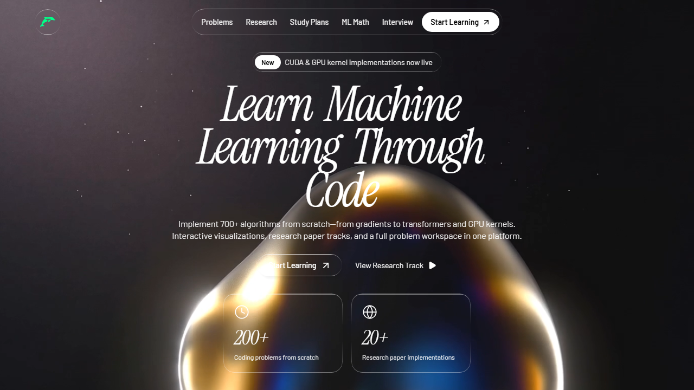
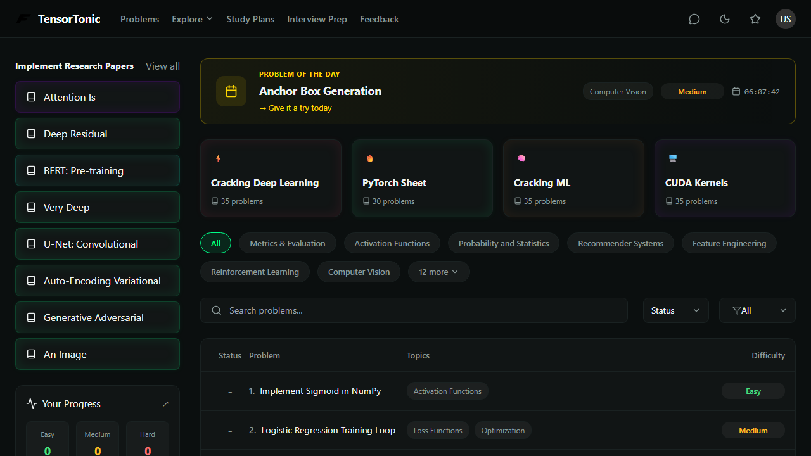
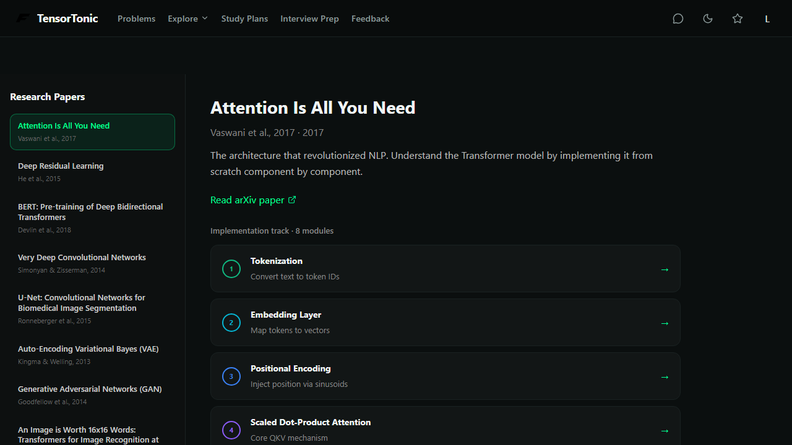
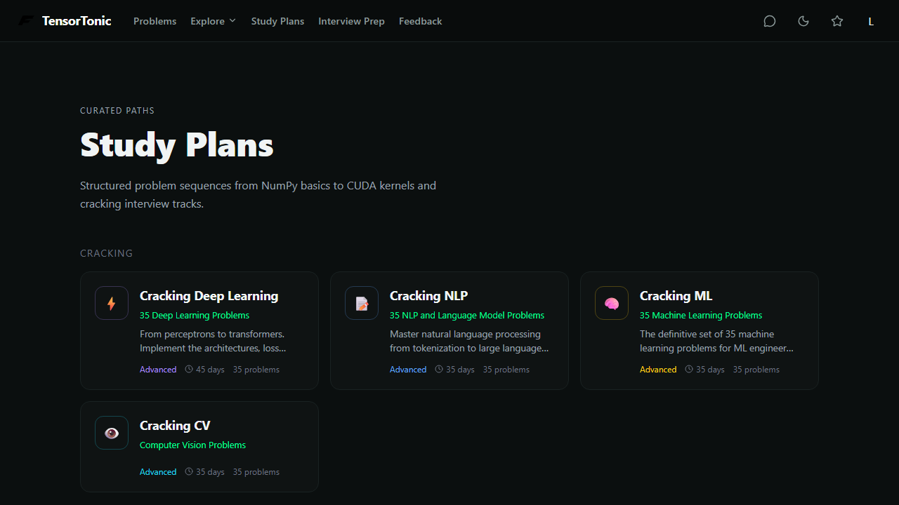

# ML-byME

**Author:** [Kartikeya](https://github.com/KartikeyaM2007) (KartikeyaM2007)

An open ML coding practice platform inspired by TensorTonic — problems, research paper tracks, study plans, math lessons, and a Python workspace with **Run** / **Submit** grading.

**Live demo:** [https://ml-by-me-git-main-kartikey-s-projects-3f2c3c42.vercel.app/](https://ml-by-me-git-main-kartikey-s-projects-3f2c3c42.vercel.app/)

| Layer | Host |
|--------|------|
| Frontend (Vite + React) | Vercel |
| API + Python grading + SQLite | Render (Docker) |

---

## What you can do

- **Problems** — 300+ exercises with Monaco editor, theory/solution tabs, notes, and stars.
- **Research** — Paper-themed tracks (Transformers, LLaMA, ResNet, …) with linked coding problems.
- **Study plans** — Structured sections and progress-style layouts.
- **ML Math** — Lessons with KaTeX markdown.
- **Interview prep** — Curated problem sets.
- **Run / Submit** — Code is checked on the Render API (Python + NumPy where implemented).

---

## Screenshots

Captured from local dev (`npm run dev` at 1280×720). Regenerate with `npm run screenshots:readme`.

### Home

Landing page — hero, research CTA, and platform stats.



### Problems workspace

Browse categories, filters, and the full problem catalog.



### Research hub

Paper tracks (Transformers, LLaMA, ResNet, …) and research-themed coding paths.



### Study plans

Curated learning paths with sections and linked exercises.



---

## Quick start (local)

```bash
git clone https://github.com/KartikeyaM2007/ML-byME.git
cd ML-byME
npm install
cp .env.example .env
```

Terminal 1 — API:

```bash
npm run backend
```

Terminal 2 — UI:

```bash
npm run dev
```

Open [http://localhost:5173](http://localhost:5173). API default: [http://localhost:3001](http://localhost:3001) (`VITE_API_URL` in `.env`).

---

## Deploy

**Step-by-step:** [DEPLOY_VERCEL_RENDER.md](./DEPLOY_VERCEL_RENDER.md)

1. **Render** — Docker (`Dockerfile`), health check `/api/health`.
2. **Vercel** — Vite build; set `VITE_API_URL=https://YOUR-SERVICE.onrender.com`.
3. **Render env** — `CORS_ORIGIN=https://your-app.vercel.app`.

Single-container local production:

```bash
npm run start
# → http://localhost:3001 (SPA + API)
```

---

## Stack

- **Frontend:** Vite, React 19, TypeScript, Monaco, KaTeX, Framer Motion
- **Backend:** Express, SQLite, child-process Python graders
- **Content:** Generated/curated data under `src/data/` (348 problems)

---

## Scripts

| Command | Description |
|---------|-------------|
| `npm run dev` | Vite dev server |
| `npm run backend` | Express API on port 3001 |
| `npm run build` | Production frontend build |
| `npm run start` | Build + serve SPA + API together |
| `npm run test:all` | Data checks, build, smoke tests |
| `npm run screenshots:readme` | Save README screenshots from localhost:5173 |

---

## Project layout

```
src/           React app, pages, workspace UI
src/data/      Problems, study plans, math, research metadata
backend/       Express API, validators, SQLite
docs/screenshots/   README images (SVG placeholders → add PNGs)
```

---

## License & attribution

Built by **Kartikeya** as an educational ML practice project. UI and content structure are inspired by [TensorTonic](https://tensortonic.com); this repo is an independent implementation for learning and portfolio use.

---

## Links

- **Repository:** [github.com/KartikeyaM2007/ML-byME](https://github.com/KartikeyaM2007/ML-byME)
- **Live app:** [ml-by-me on Vercel](https://ml-by-me-git-main-kartikey-s-projects-3f2c3c42.vercel.app/)
